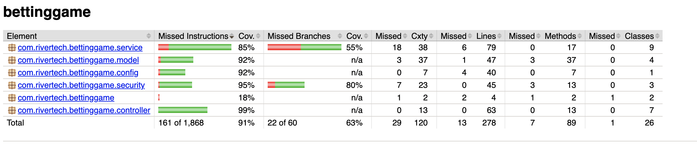

## Recording Service
## Introduction
This project is a backend service for a betting game built in Kotlin.
## Purpose
This project is a demo for the RiverTech interview process, it's main purpose is to showcase the ability to develop a Kotlin application.
## Technologies Used
- **Kotlin 1.9.25** - Programming Language
- **Java 17** - Programming Language
- **Spring Boot 3.2+** - Framework
- **Spring Data JPA** - Database ORM
- **H2 Database** - Persistence
- **Spring Boot Validation** - Data Validation
- **Spring Boot Security** - Authentication
- **Jason Web Token** - Tokenization
- **Gradle** - Build Tool
- **Swagger** - API Documentation
- **MockK** - Testing
- **JUnit 5** - Testing Framework
- **SLF4J** - Logging
- **Jacoco** - Test Coverage Reporting
## Features
- Player can register and then login.
- Player can place a bet.
- Player's wallet contains actual status.
- Player can see the leaderboard.
## Project structure
    ```shell
    bettinggame/
    ├── src/main/kotlin/com/rivertech/bettinggame/
    │   ├── config/
    │   ├── controller/
    │   ├── model/
    │   ├── repository/
    │   ├── security/
    │   ├── service/
    ├── src/test/kotlin/com/rivertech/bettinggame/

    ```
## Installation
1. Pre-requisites: Download IntelliJ, Postman, Java17.
2. Add a valid JWT secret and expiration time to system in your `.zshrc` or `.bashrc` as the application will try to read these values from there.
    ```shell
    export JWT_SECRET=[your-valid-generated-secret]
    export JWT_EXPIRATION_MS=[human-date-converted-to-epoch-timestamp]
    ```
3. Clone the repository to your local.
    ```shell
    git clone  https://github.com/Dzsodie/bettinggame.git
    ```
## Starting the application
1. Build the application
   ```shell
   ./gradlew clean build
   ```
2. Start the service with the following command from the root folder of the cloned application.
   ```shell
   ./gradlew bootRun
   ```
## Testing with Postman
1. Find the postman collection 'bettinggame.postman-collection.json' which is in the root directory.
2. Import the collection to your Postman client.
3. Start the application.
4. Use the Register endpoint first.
- Response should look like the following.
   ```shell
   {
    "id": 1,
    "name": "John",
    "surname": "Doe",
    "username": "johndoe",
    "password": "password",
    "roles": [
        "ROLE_PLAYER"
    ],
    "authorities": [
        {
            "authority": "ROLE_PLAYER"
        }
    ]
    }
   ```
5. Now send the request to the Login endpoint.
- Response should look like the following.
    ```shell
    {
        "token": {
            "id": 1,
            "name": "John",
            "surname": "Doe",
            "username": "johndoe",
            "password": "password",
            "roles": [
                "ROLE_PLAYER"
            ],
            "authorities": [
                {
                    "authority": "ROLE_PLAYER"
                }
            ]
        }
    }
    ```
6. You can send request to the Place Bet, the Player Wallet, the Leaderboard, or the Transaction History endpoints now.
- Place Bet response.
   ```shell
   {
     "id": 1,
     "player": {
       "id": 1,
       "name": "John",
       "surname": "Doe",
       "username": "johndoe"
     },
     "betAmount": 50.0,
     "chosenNumber": 5,
     "generatedNumber": 4,
     "result": "WIN",
     "winnings": 250.0
   }
   ```
- Player Wallet response.
   ```shell
   {
     "id": 1,
     "balance": 1200.0
   }
   ```
- Leaderboard response.
   ```shell
   [
     {
       "username": "johndoe",
       "totalWinnings": 1200.0
     },
     {
       "username": "janedoe",
       "totalWinnings": 800.0
     }
   ]
   ```
- Transaction History response.
```shell
[
    {
        "id": 1,
        "initialBalance": 1000.0,
        "betAmount": 50.0,
        "result": "WIN",
        "winnings": 500.0,
        "finalBalance": 1450.0,
        "timestamp": "2025-02-18T15:56:12.14371",
        "player": {
            "id": 1,
            "name": "John",
            "surname": "Doe",
            "username": "johndoe",
            "wallet": {
                "id": 1,
                "balance": 1325.0
            }
        }
    },
    {
        "id": 2,
        "initialBalance": 1450.0,
        "betAmount": 50.0,
        "result": "WIN",
        "winnings": 25.0,
        "finalBalance": 1425.0,
        "timestamp": "2025-02-18T15:56:13.465471",
        "player": {
            "id": 1,
            "name": "John",
            "surname": "Doe",
            "username": "johndoe",
            "wallet": {
                "id": 1,
                "balance": 1325.0
            }
        }
    },
    {
        "id": 3,
        "initialBalance": 1425.0,
        "betAmount": 50.0,
        "result": "LOSE",
        "winnings": 0.0,
        "finalBalance": 1375.0,
        "timestamp": "2025-02-18T15:56:14.587555",
        "player": {
            "id": 1,
            "name": "John",
            "surname": "Doe",
            "username": "johndoe",
            "wallet": {
                "id": 1,
                "balance": 1325.0
            }
        }
    },
    {
        "id": 4,
        "initialBalance": 1375.0,
        "betAmount": 50.0,
        "result": "LOSE",
        "winnings": 0.0,
        "finalBalance": 1325.0,
        "timestamp": "2025-02-18T15:56:15.79685",
        "player": {
            "id": 1,
            "name": "John",
            "surname": "Doe",
            "username": "johndoe",
            "wallet": {
                "id": 1,
                "balance": 1325.0
            }
        }
    }
]
```
## API documentation
Access Swagger UI at http://localhost:8080/swagger-ui.html after running the app.
## Logging and monitoring
1. SLF4J is used for logging.
2. Application logs for debugging can be found at `logs/bettinggame.log`.
3. Log aggregation is not yet implemented.
4. The `application.properties` contains the settings for log level and log structure.
5. The log rolling policy is configured in the `logback-spring.xml`.
## Testing
1. MockK and JUnit5 is used for the unit testing.
2. Test coverage needs to be improved. Coverage report can be created with this command.
   ```shell
    ./gradlew jacocoTestReport
   ```
3. Coverage report can be found on this path.
    ```shell
    build/reports/jacoco/test/html/index.html
    ```
4. Then the report can be opened in a browser.
   
5. Unit tests can be run with the following command.
    ```shell
    ./gradlew test
    ```
## License
This project is licensed under the MIT License. See the [LICENSE](LICENSE) file for details.